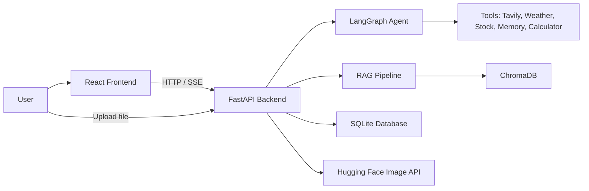

# NexaAI-A Smart Chatbot

NexaAI is a full-stack AI chatbot built with Python and React. It combines a LangGraph-based agent, document-aware retrieval, web search, and image generation to support conversational Q&A, chat history, thread-based memory, and uploaded document analysis in a single interface.

## ✨ Features

- Chat with a streaming AI agent using Groq-hosted LLM models.
- Upload PDF, DOCX, TXT, MD, PY, and CSV files for document-grounded Q&A via a ChromaDB-backed RAG pipeline.
- Search the web with Tavily for current or time-sensitive information.
- Keep memory per conversation thread using SQLite-backed persistent storage.
- Use built-in tools for calculator, weather, and stock quote lookups.
- Generate AI images from text prompts using Hugging Face Inference.
- Maintain separate conversation threads and histories in the frontend sidebar.
- Support real-time streaming responses and live thinking states in the UI.

## 🛠️ Tech Stack

### Frontend
- React
- TypeScript
- Vite
- Tailwind CSS
- React Markdown + KaTeX support for rich chat rendering
- Axios for API calls

### Backend
- Python
- FastAPI
- Uvicorn
- LangGraph
- LangChain
- Pydantic

### Database
- SQLite
- SQLAlchemy
- ChromaDB

### AI / ML
- LangChain Groq integration
- Google Generative AI embeddings
- Hugging Face Inference
- Tavily Search
- PDF / DOCX / text extraction utilities

### APIs / Tools
- Groq API for chat generation
- Hugging Face image generation endpoint
- Tavily Search API
- OpenWeather API
- Alpha Vantage API

## 🏗️ Project Architecture

The frontend is a React app that sends chat and upload requests to the FastAPI backend. The backend initializes a LangGraph agent, manages tool execution, stores thread history, and serves streaming responses with SSE. Uploaded files are parsed, chunked, embedded with Google embeddings, and stored in ChromaDB for retrieval-augmented generation. SQLite stores conversation metadata and messages.



## 📁 Project Structure

- `backend/` — FastAPI server, agent logic, database layer, RAG, and tools.
  - `app.py` — API routes, CORS config, SSE chat streaming, image generation, uploads.
  - `agent.py` — LangGraph workflow and model selection logic.
  - `database.py` — SQLite models and CRUD helpers.
  - `rag.py` — document ingestion, chunking, embeddings, and retrieval.
  - `tools.py` — agent tools for web search, memory, calculator, weather, stock, and document lookups.
  - `test.py` — small backend test script.
- `frontend/` — Vite + React client application.
  - `src/` — app layout, chat UI, sidebar, message input, API service layer.
- `data/` — runtime SQLite data storage.
- `uploads/` — uploaded user documents.
- `chroma_db/` — persistent vector store files for document embeddings.
- `requirements.txt` — Python dependencies.
- `frontend/package.json` — frontend package setup and scripts.

## ⚙️ Installation & Setup

### Prerequisites

- Python 3.10+
- Node.js 18+
- npm
- Poppler and Tesseract OCR for scanned PDF processing in `backend/rag.py`

### 1) Clone and install backend dependencies

```bash
cd NexaAI_A-Smart-Chatbot
pip install -r requirements.txt
```

### 2) Configure environment variables

Create a `.env` file in the project root with the required keys:

```env
GROQ_API_KEY=your_groq_api_key
HF_TOKEN=your_huggingface_token
GOOGLE_API_KEY=your_google_api_key
TAVILY_API_KEY=your_tavily_api_key
OPENWEATHER_API_KEY=your_openweather_api_key
ALPHA_VANTAGE_API_KEY=your_alpha_vantage_api_key
```

> Keep the `.env` file local to your machine and do not commit secrets.

### 3) Install frontend dependencies

```bash
cd frontend
npm install
```

### 4) Start the backend

```bash
cd backend
uvicorn app:app --host 0.0.0.0 --port 8000 --reload
```

### 5) Start the frontend

```bash
cd frontend
npm run dev
```

The frontend typically runs on `http://localhost:5173` and the backend on `http://localhost:8000`.

## 🚀 Usage

1. Open the frontend in the browser.
2. Start a new conversation from the sidebar.
3. Ask a question directly or upload a document for grounded answers.
4. For content that requires current information, the agent can use Tavily web search.
5. Use text prompts, document analysis, and image generation depending on the request.

## 🔌 API / Tools

The backend exposes these key routes:

- `GET /` — health check.
- `GET /conversations` — list conversation threads.
- `GET /history/{thread_id}` — get prior chat history for a thread.
- `POST /upload` — upload a supported document file and index it into the RAG store.
- `POST /chat/stream` — stream AI responses using Server-Sent Events.
- `POST /generate-image` — generate an image from a text prompt.

The agent also includes runtime tools for:

- `calculator` — safe in-process math evaluation
- `search_uploaded_document` — retrieve relevant document chunks from ChromaDB
- `web_search` — Tavily-powered search
- `remember_fact` / `recall_memory` — per-thread memory persistence
- `get_stock_price` — Alpha Vantage quote lookup
- `get_weather` — OpenWeather lookup

## 👨‍💻 Author

Tayyaba Akhter
